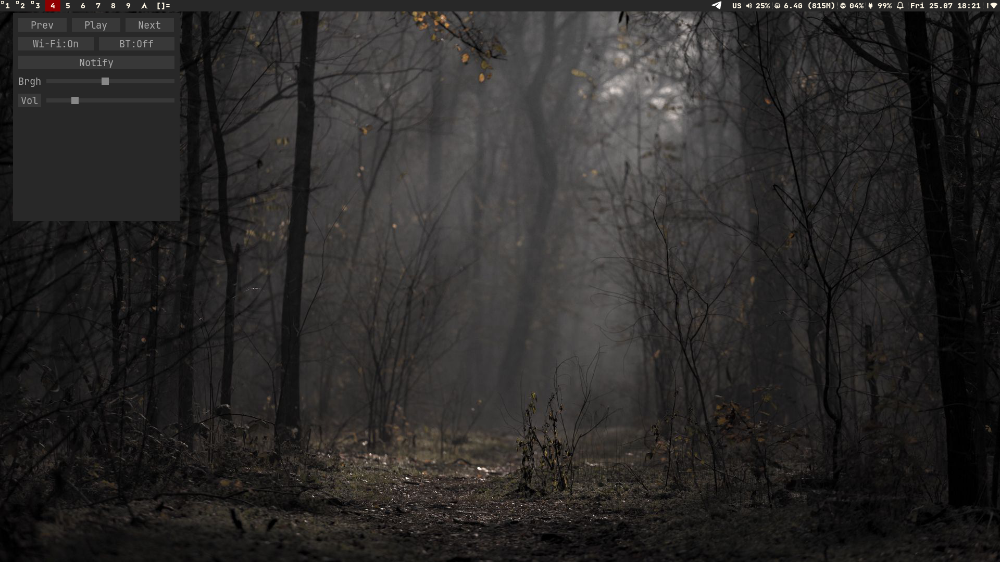

# ControlCenter

A lightweight and minimalistic control panel for X11 (and Wayland in the future), written in C.



## Features

Currently, the panel allows you to:
- Manage **volume** (up, down, mute)
- Manage **brightness**
- Switch **track in media player** (next, previous, pause/play)
- [Future plans](plan.md)

## Dependencies

Requires:
- `gcc make`
- `x11`, `xft`

```bash
# pacman -S libx11 libxft
